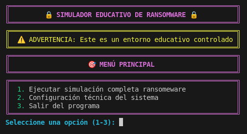
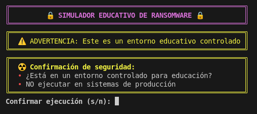
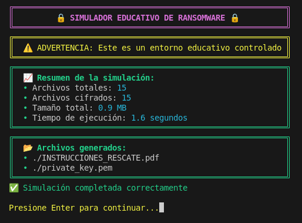
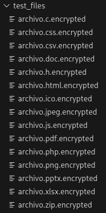
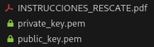
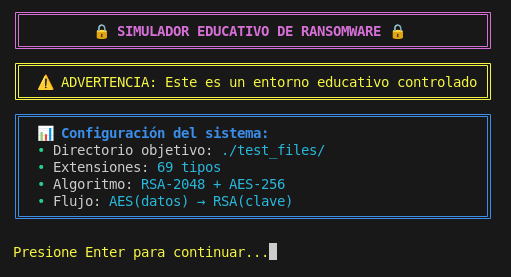
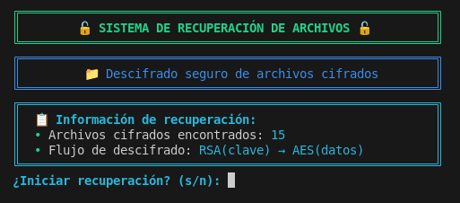
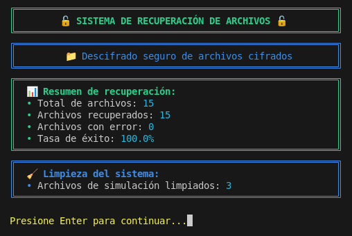

# 🔒 SafeRansomwareLab


Laboratorio Seguro para Simulación Educativa de Ransomware - **Cifrado Híbrido RSA+AES**

---


> [!WARNING]  
>🚨 **AVISO IMPORTANTE:** Este software es **ÚNICAMENTE** para fines educativos en entornos controlados. El mal uso de este código puede violar leyes locales e internacionales. **Los desarrolladores no se hacen responsables del uso indebido.**

---

## 🎯 Descripción del Proyecto
**SafeRansomwareLab** es un simulador educativo avanzado que replica el comportamiento del ransomware moderno utilizando técnicas de cifrado híbrido (**RSA‑2048 + AES‑256‑CBC**). El proyecto está diseñado específicamente para:

- Educar sobre técnicas de ransomware reales  
- Investigar mecanismos de defensa  
- Entrenar equipos de respuesta a incidentes  
- Desarrollar herramientas de detección y prevención  

### 🎓 Objetivos Educativos
- Comprender el funcionamiento del cifrado híbrido  
- Analizar vectores de ataque de ransomware  
- Desarrollar habilidades de análisis forense  
- Aprender técnicas de recuperación de datos  
- Implementar estrategias de prevención  

---

## ✨ Características Principales

### 🔐 Cifrado Avanzado
- **Cifrado Híbrido:** RSA‑2048 para claves + AES‑256‑CBC para datos  
- **Clave Única por Archivo:** Cada archivo tiene su propia clave AES  
- **IV Aleatorio:** Vector de inicialización único por archivo  
- **Padding PKCS7:** Estándar industrial para datos  

### 🎨 Interfaz Profesional
- **Interfaz Rich:** Consola colorida con barras de progreso  
- **Menús Interactivos:** Navegación con *questionary*  
- **Paneles Compactos:** Diseño eficiente sin espacio desperdiciado  
- **Feedback en Tiempo Real:** Progreso y estadísticas inmediatas  

### 📊 Funcionalidades Completas
- **Entorno de Prueba Automático:** Genera archivos de ejemplo  
- **PDF de Rescate:** Genera instrucciones realistas de “rescate”  
- **Estadísticas Detalladas:** Métricas completas del proceso  
- **Recuperación Garantizada:** Script de descifrado incluido  
- **Limpieza Automática:** Eliminación segura de archivos temporales  

### 🛡️ Características de Seguridad
- **Aislamiento:** Solo opera en `./test_files/`  
- **Confirmaciones Múltiples:** Verificaciones antes de ejecutar  
- **Exclusión de Sistema:** No afecta archivos críticos  
- **Logging Detallado:** Registro completo de actividades  

---

## 💻 Requisitos del Sistema

### 📦 Dependencias Python
```
cryptography>=3.4.8
rich>=10.0.0
questionary>=1.10.0
reportlab>=3.6.8
qrcode[pil]>=7.3.1
Pillow>=8.3.0
```

---

### 🗃️ Archivos Generados
- `private_key.pem`: Clave privada RSA (recuperación)  
- `public_key.pem`: Clave pública RSA (cifrado)  
- `INSTRUCCIONES_RESCATE.pdf`: PDF de “rescate” simulado  
- `README_RECOVER.txt`: Instrucciones de recuperación  

---

## 🔬 Explicación Técnica

### 🧩 Arquitectura de Cifrado Híbrido
**Flujo por archivo:**
1. Generar clave AES‑256 única  
2. Cifrar archivo con AES‑256‑CBC  
3. Cifrar clave AES con RSA‑2048  
4. Guardar: `IV + len(clave_AES_cifrada) + clave_AES_cifrada + datos_cifrados`

**Estructura del archivo cifrado:**  
`[16 bytes: IV] + [4 bytes: longitud clave] + [N bytes: clave cifrada] + [M bytes: datos cifrados]`

### 🔐 Algoritmos Implementados
| Algoritmo     | Uso                      | Seguridad |
|---------------|---------------------------|-----------|
| RSA‑2048      | Cifrado de claves AES     | ~112 bits |
| AES‑256‑CBC   | Cifrado de datos          | 256 bits  |
| OAEP Padding  | Padding RSA               | Anti‑ataques |
| PKCS7         | Padding AES               | Estándar  |

---

## 🖼️ Galería del Sistema

> **Orden requerido:** banner → 0 → 1 → 2 → 3 → 4 → 5 → 6 → 7 → 8

1. **Archivos Desencriptados**  
   

2. **Menú Principal**  
   

3. **Menú Principal – Opción 1**  
   

4. **Menú Principal – Opción 1 (Fin)**  
   

5. **Archivos Encriptados**  
   

6. **Archivos – Recuperación**  
   

7. **Menú Principal – Opción 2**  
   

8. **Menú Secundario**  
   

9. **Menú Secundario – S**  
   


## 📫 Contact

Si tienes dudas o deseas aportar sugerencias puedes escribirme a: [marichu.private@proton.me](mailto:marichu.private@proton.me)

## 📄 License

Este proyecto está licenciado bajo la **Licencia MIT**. Consulte el archivo [LICENCIA](LICENCIA) para más detalles.
