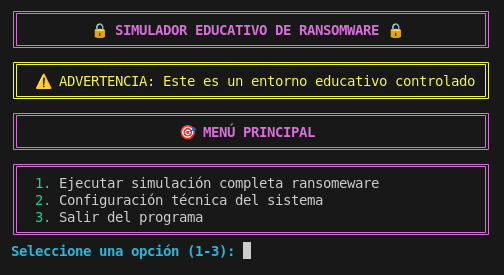
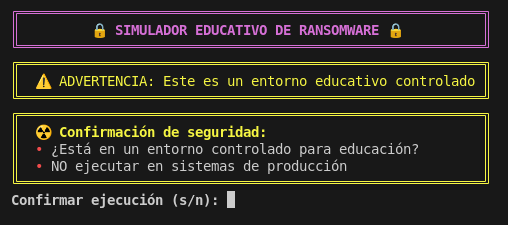
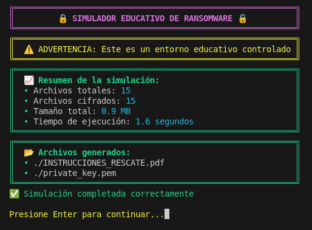
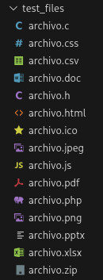
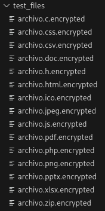
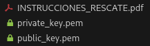
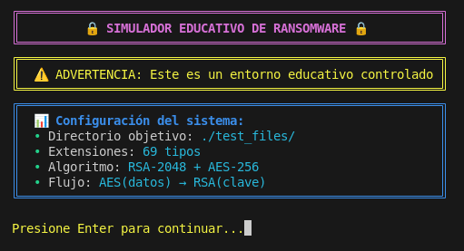
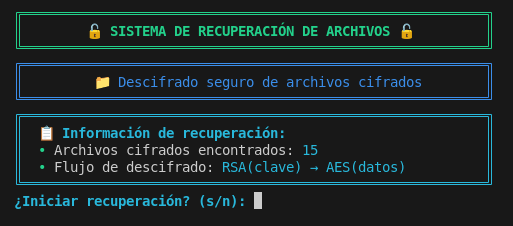
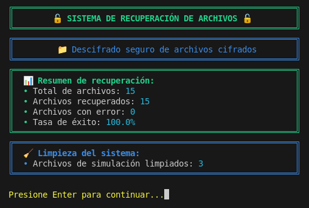

# 🔒 SafeRansomwareLab

> [!WARNING]  
>**AVISO IMPORTANTE:** Este software es **ÚNICAMENTE** para fines educativos en entornos controlados. El mal uso de este código viola leyes con penas de carcel. **No me hago responsables del uso indebido.**


> [!NOTE]  
> **Photo © Shutterstock**. Todos los derechos reservados. Esta imagen se utiliza únicamente con fines ilustrativos.

## 🎯 Descripción del Proyecto
**SafeRansomwareLab** es un **simulador educativo de ransomware** que implementa un **sistema de cifrado híbrido** combinando RSA para el intercambio seguro de claves y AES-256 para el cifrado de archivos. Desarrollado en Python, el software simula el comportamiento de ransomware real generando un par de claves pública/privada RSA, donde la clave AES simétrica utilizada para cifrar archivos (documentos, imágenes, PDFs, comprimidos, etc.) en la carpeta `test_files` es a su vez cifrada con la clave pública RSA. El sistema incluye mecanismos de recuperación educativos que permiten descifrar los archivos utilizando la clave privada RSA correspondiente, demostrando así técnicas criptográficas avanzadas en un entorno controlado y seguro para fines de formación en ciberseguridad.

---

### 📦 Requisitos del Sistema `requirements.txt`
```
cryptography>=3.4.8
rich>=10.0.0
questionary>=1.10.0
reportlab>=3.6.8
qrcode[pil]>=7.3.1
Pillow>=8.3.0
```

---

### 🗃️ Archivos generados tras el cifrado/captura de los archivos
- `private_key.pem`: Clave privada RSA (recuperación)  
- `public_key.pem`: Clave pública RSA (cifrado)  
- `INSTRUCCIONES_RESCATE.pdf`: PDF de “rescate” simulado con los pasos a seguir

---

## 🔐 Especificaciones Criptográficas Usadas

| Componente | Algoritmo | Parámetros | Propósito | Nivel de Seguridad |
|------------|-----------|------------|-----------|-------------------|
| **Cifrado de Datos** | AES-256 | CBC Mode, PKCS7 Padding | Cifrado eficiente de archivos | 256 bits |
| **Intercambio de Claves** | RSA-2048 | OAEP with SHA-256 | Protección segura de claves AES | ~112 bits |
| **Generación de IV** | CSPRNG | 16 bytes | Unicidad por archivo | 128 bits |
| **Padding Asimétrico** | RSA-OAEP | MGF1 SHA-256 | Prevención de ataques | Estándar PKCS#1 |

---

## 🖼️ Galería de la Demo **SafeRansomwareLab**

1. **Interfaz principal**, donde el usuario puede ejecutar el "hackeo", ver los parámetros técnicos o salir del programa.
   
   

---

2. **Pantalla de confirmación**, donde el usuario valida la ejecución segura de la simulación (opción 1).
  
   

---

3. **Resumen final**, donde se muestran los archivos cifrados, su tamaño y los ficheros generados tras el proceso.
   
   

---

4. **Comparativa de los archivos antes y después del cifrado**, mostrando la extensión añadida tras la encriptación.

   <div style="display:flex; justify-content:center; gap:10px;">
     
     
   </div>

---

5. **Archivos generados para la recuperación**, incluyendo las claves RSA y las instrucciones de descifrado.
   
   <p align="left">
     
   </p>

---

6. **Configuración del sistema**, donde se muestran las rutas, tipos de archivos y algoritmos (opción 2).

   

---

7. **Resumen del hackeo**, donde se muestra la cantidad de archivos cifrados y algoritmos empleados.

   

---

8. **Pantalla de recuperación**, que muestra el resumen del descifrado y la limpieza de archivos de simulación.

   

---

## 📁 Extensiones Objetivo para Simulación (Personalizable Según el Usuario)

Puedes personalizar la lista `TARGET_EXTENSIONS` según tus necesidades educativas.  
Los ransomware reales suelen atacar extensiones de valor donde un usuario perdería información crítica.

```python
TARGET_EXTENSIONS = {
    # Documentos y textos
    '.pdf', '.doc', '.docx', '.ppt', '.pptx', '.xls', '.xlsx', '.odt', '.ods', '.odp', 
    '.txt', '.rtf', '.tex', '.md',
    
    # Imágenes y diseños
    '.jpg', '.jpeg', '.png', '.bmp', '.gif', '.tiff', '.svg', '.raw', '.cr2', '.nef', 
    '.arw', '.webp', '.ico', '.psd', '.ai', '.eps', '.dwg',
    
    # Archivos comprimidos y contenedores
    '.zip', '.rar', '.7z', '.tar', '.gz', '.bz2', '.xz', '.iso', '.dmg', '.pkg',
    
    # Audio y video
    '.mp3', '.mp4', '.avi', '.mov', '.wmv', '.flv', '.mkv', '.wav', '.flac', '.aac', 
    '.ogg', '.m4a',
    
    # Bases de datos y datos estructurados
    '.sql', '.db', '.mdb', '.accdb', '.sqlite', '.csv', '.json', '.xml',
    
    # Código fuente y ejecutables
    '.py', '.js', '.html', '.css', '.php', '.cpp', '.java', '.c', '.h', '.exe', 
    '.dll', '.msi'
}
```

---

## 📄 INSTRUCCIONES_RESCATE.pdf

Archivo de ejemplo con las instrucciones completas para la recuperación de archivos encriptados, simula un PDF de un rescate real por parte de una hacker. 

[🔓 Abrir instrucciones de rescate ejemplo](./INSTRUCCIONES_RESCATE.pdf)

Ejemplo: para recuperarlos, **sigue estas instrucciones al pie de la letra**:

1. **Descarga el Navegador Tor** desde el sitio oficial para acceder de forma anónima:  
   👉 [https://www.torproject.org/es/download/](https://www.torproject.org/es/download)

2. **Accede a nuestro servicio en la Dark Web** utilizando la siguiente dirección **.onion**:  
   🔗 `http://xxxxxxxxxxxxxxxxxxxxxxxxxxxxx.onion` *(Dirección .onion de ejemplo)*

3. **Realiza el pago en Bitcoin (BTC)** a la dirección única que se muestra (texto/QR).  
   Para tu comodidad, puedes escanear el **código QR** con tu billetera para completar la transacción rápidamente.

---

## 📫 Contact

Si tienes dudas o deseas aportar sugerencias puedes escribirme a: [marichu.private@proton.me](mailto:marichu.private@proton.me)

## 📄 License

Este proyecto está licenciado bajo la **Licencia MIT**. Consulte el archivo [LICENCIA](LICENCIA) para más detalles.
