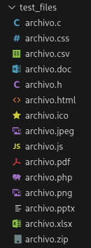

# 🔒 SafeRansomwareLab


Laboratorio Seguro para Simulación Educativa de Ransomware - **Cifrado Híbrido RSA+AES**

---

## ⚠️ ADVERTENCIA CRÍTICA DE SEGURIDAD

🚨 **AVISO IMPORTANTE:** Este software es **ÚNICAMENTE** para fines educativos en entornos controlados. El mal uso de este código puede violar leyes locales e internacionales. **Los desarrolladores no se hacen responsables del uso indebido.**

**❌ PROHIBIDO:**  
- Ejecutar en sistemas de producción  
- Usar con datos reales  
- Dirigir a terceros sin consentimiento  
- Utilizar con fines maliciosos  

**✅ PERMITIDO:**  
- Educación en ciberseguridad  
- Investigación académica  
- Entrenamiento en entornos controlados  
- Desarrollo de defensas anti‑ransomware  

---

## 📖 Tabla de Contenidos
- [Descripción del Proyecto](#-descripción-del-proyecto)
- [Características Principales](#-características-principales)
- [Requisitos del Sistema](#-requisitos-del-sistema)
- [Instalación](#-instalación)
- [Uso del Simulador](#-uso-del-simulador)
- [Estructura del Proyecto](#-estructura-del-proyecto)
- [Explicación Técnica](#-explicación-técnica)
- [Flujo de Trabajo](#-flujo-de-trabajo)
- [Galería del Sistema](#-galería-del-sistema)
- [Consideraciones Éticas](#-consideraciones-éticas)
- [Preguntas Frecuentes](#-preguntas-frecuentes)
- [Contribución](#-contribución)
- [Licencia](#-licencia)

---

## 🎯 Descripción del Proyecto
**SafeRansomwareLab** es un simulador educativo avanzado que replica el comportamiento del ransomware moderno utilizando técnicas de cifrado híbrido (**RSA‑2048 + AES‑256‑CBC**). El proyecto está diseñado específicamente para:

- Educar sobre técnicas de ransomware reales  
- Investigar mecanismos de defensa  
- Entrenar equipos de respuesta a incidentes  
- Desarrollar herramientas de detección y prevención  

### 🎓 Objetivos Educativos
- Comprender el funcionamiento del cifrado híbrido  
- Analizar vectores de ataque de ransomware  
- Desarrollar habilidades de análisis forense  
- Aprender técnicas de recuperación de datos  
- Implementar estrategias de prevención  

---

## ✨ Características Principales

### 🔐 Cifrado Avanzado
- **Cifrado Híbrido:** RSA‑2048 para claves + AES‑256‑CBC para datos  
- **Clave Única por Archivo:** Cada archivo tiene su propia clave AES  
- **IV Aleatorio:** Vector de inicialización único por archivo  
- **Padding PKCS7:** Estándar industrial para datos  

### 🎨 Interfaz Profesional
- **Interfaz Rich:** Consola colorida con barras de progreso  
- **Menús Interactivos:** Navegación con *questionary*  
- **Paneles Compactos:** Diseño eficiente sin espacio desperdiciado  
- **Feedback en Tiempo Real:** Progreso y estadísticas inmediatas  

### 📊 Funcionalidades Completas
- **Entorno de Prueba Automático:** Genera archivos de ejemplo  
- **PDF de Rescate:** Genera instrucciones realistas de “rescate” 
- **Estadísticas Detalladas:** Métricas completas del proceso  
- **Recuperación Garantizada:** Script de descifrado incluido  
- **Limpieza Automática:** Eliminación segura de archivos temporales  

### 🛡️ Características de Seguridad
- **Aislamiento:** Solo opera en `./test_files/`  
- **Confirmaciones Múltiples:** Verificaciones antes de ejecutar  
- **Exclusión de Sistema:** No afecta archivos críticos  
- **Logging Detallado:** Registro completo de actividades  

---

## 💻 Requisitos del Sistema

### 📋 Requisitos Mínimos
- **Python:** 3.8 o superior  
- **Sistema Operativo:** Linux, macOS o Windows 10+  
- **RAM:** 4 GB mínimo  
- **Almacenamiento:** 500 MB de espacio libre  

### 📦 Dependencias Python
```
cryptography>=3.4.8
rich>=10.0.0
questionary>=1.10.0
reportlab>=3.6.8
qrcode[pil]>=7.3.1
Pillow>=8.3.0
```

---

## 🚀 Instalación

### Método 1: Instalación Directa
```bash
# Clonar el repositorio
git clone https://github.com/TU_USUARIO/SafeRansomwareLab.git
cd SafeRansomwareLab

# Crear entorno virtual (recomendado)
python -m venv venv
source venv/bin/activate  # Linux/macOS
# venv\Scriptsctivate   # Windows

# Instalar dependencias
pip install -r requirements.txt
```

### Método 2: Desarrollo
```bash
# Instalar en modo desarrollo
pip install -e .

# O instalar dependencias manualmente
pip install cryptography rich questionary reportlab "qrcode[pil]" pillow
```

### ✅ Verificación de Instalación
```bash
python -c "import cryptography, rich, questionary, reportlab, qrcode, PIL; print('✅ Todas las dependencias están instaladas')"
```

---

## 🎮 Uso del Simulador

### 🔧 Configuración Inicial
```bash
cd SafeRansomwareLab
source venv/bin/activate  # si creaste venv
```

### 🖥️ Ejecución del Simulador Principal
```bash
python simulated_ransomware_advanced.py
```
**Flujo de la interfaz:**
1. Pantalla de bienvenida con advertencias de seguridad  
2. Menú principal con tres opciones  
3. Confirmación de entorno controlado  
4. Ejecución con barra de progreso  
5. Resumen final con estadísticas  

### 📁 Estructura de Comandos
```bash
# Simulador principal
python simulated_ransomware_advanced.py

# Script de recuperación
python decrypt_files_advanced.py

# Verificar archivos generados
ls -la *.pdf *.pem *.txt
```

### 🗂️ Directorio de Trabajo
El simulador opera exclusivamente en `./test_files/`:

```bash
test_files/
├── documento_importante.pdf
├── foto_vacaciones.jpg
├── base_datos.sql
├── contrato.docx
├── backup.zip
└── ... (más archivos de ejemplo)
```

---

## 📁 Estructura del Proyecto
```
SafeRansomwareLab/
├── 📄 simulated_ransomware_advanced.py  # Simulador principal
├── 🔓 decrypt_files_advanced.py         # Script de recuperación
├── 📋 requirements.txt                  # Dependencias del proyecto
├── 📚 README.md                         # Este archivo
├── 🚫 .gitignore                        # Archivos excluidos de Git
└── 📁 test_files/                       # Directorio de trabajo
    ├── 📄 *.encrypted                   # Archivos cifrados
    └── 📄 *                             # Archivos originales
```

### 🗃️ Archivos Generados
- `private_key.pem`: Clave privada RSA (recuperación)  
- `public_key.pem`: Clave pública RSA (cifrado)  
- `INSTRUCCIONES_RESCATE.pdf`: PDF de “rescate” simulado  
- `README_RECOVER.txt`: Instrucciones de recuperación  

---

## 🔬 Explicación Técnica

### 🧩 Arquitectura de Cifrado Híbrido
**Flujo por archivo:**
1. Generar clave AES‑256 única  
2. Cifrar archivo con AES‑256‑CBC  
3. Cifrar clave AES con RSA‑2048  
4. Guardar: `IV + len(clave_AES_cifrada) + clave_AES_cifrada + datos_cifrados`

**Estructura del archivo cifrado:**  
`[16 bytes: IV] + [4 bytes: longitud clave] + [N bytes: clave cifrada] + [M bytes: datos cifrados]`

### 🔐 Algoritmos Implementados
| Algoritmo     | Uso                      | Seguridad |
|---------------|---------------------------|-----------|
| RSA‑2048      | Cifrado de claves AES     | ~112 bits |
| AES‑256‑CBC   | Cifrado de datos          | 256 bits  |
| OAEP Padding  | Padding RSA               | Anti‑ataques |
| PKCS7         | Padding AES               | Estándar  |

---

## 🔄 Flujo de Trabajo

### 1) Preparación del Entorno
```bash
python -m venv lab_env
source lab_env/bin/activate
pip install -r requirements.txt
```

### 2) Ejecución del Simulador
```bash
python simulated_ransomware_advanced.py
# → Seleccionar opción 1 (Ejecutar simulación)
# → Confirmar entorno controlado
# → Observar proceso de cifrado
```

### 3) Análisis de Resultados
```bash
ls -la test_files/*.encrypted      # Ver archivos cifrados
open INSTRUCCIONES_RESCATE.pdf    # Examinar PDF de rescate (macOS)
```

### 4) Recuperación de Archivos
```bash
python decrypt_files_advanced.py
# → Confirmar recuperación
# → Observar proceso de descifrado
# → Verificar archivos restaurados
```

### 5) Limpieza
```bash
# Los archivos temporales se eliminan automáticamente
# El entorno queda listo para la siguiente simulación
```

---

## 🖼️ Galería del Sistema

> **Orden requerido:** banner → 0 → 1 → 2 → 3 → 4 → 5 → 6 → 7 → 8

1. **Archivos Desencriptados**  
   

2. **Menú Principal**  
   

3. **Menú Principal – Opción 1**  
   

4. **Menú Principal – Opción 1 (Fin)**  
   

5. **Archivos Encriptados**  
   

6. **Archivos – Recuperación**  
   

7. **Menú Principal – Opción 2**  
   

8. **Menú Secundario**  
   

9. **Menú Secundario – S**  
   

---

## ⚖️ Consideraciones Éticas

### 🎯 Principios de Diseño
- **Transparencia:** Código abierto y documentado  
- **Contención:** Opera solo en directorio designado  
- **Recuperabilidad:** Descifrado siempre posible  
- **Educación:** Enfoque en aprendizaje y prevención  

### 🛡️ Guías de Uso Responsable
**✅ USO APROPIADO:**  
- Laboratorios educativos certificados  
- Entrenamiento de equipos rojos/blues  
- Investigación académica supervisada  
- Desarrollo de herramientas defensivas  

**❌ USO INAPROPIADO:**  
- Sistemas de producción  
- Datos de terceros sin consentimiento  
- Actividades ilegales  
- Extorsión o daño real  

### 📜 Cumplimiento Legal
Este software se ofrece para fines educativos y de investigación bajo prácticas responsables y legales.

---

## ❓ Preguntas Frecuentes

**🤔 ¿Es seguro ejecutar este código?**  
✅ Sí, si se usa en entornos controlados. El código:  
- Solo afecta `./test_files/`  
- Incluye recuperación garantizada  
- Tiene múltiples confirmaciones de seguridad  
- No se conecta a redes externas  

**🔒 ¿Qué hace diferente a este simulador?**  
- Cifrado híbrido (RSA + AES) como ransomware real  
- Interfaz profesional con *rich* y *questionary*  
- PDF de rescate realista para entrenamiento  
- Métricas completas para análisis  

**🎓 ¿Qué puedo aprender con este proyecto?**  
- Técnicas de cifrado modernas  
- Análisis de comportamiento de malware  
- Estrategias de recuperación  
- Desarrollo de herramientas de seguridad  

**🚨 ¿Qué hago si accidentalmente lo ejecuto en un sistema real?**  
- NO entrar en pánico  
- Ejecutar `python decrypt_files_advanced.py`  
- Revisar logs para verificación  

**🔧 ¿Puedo modificar el código?**  
✅ Sí, este es un proyecto educativo. Se recomienda:  
- Mantener las salvaguardas de seguridad  
- Documentar cambios  
- Usar solo en entornos controlados  

---

## 👥 Contribución

### 🎯 Cómo Contribuir
1. Fork del repositorio  
2. Crea una rama: `git checkout -b feature/nueva-caracteristica`  
3. Commit: `git commit -am 'feat: nueva característica'`  
4. Push: `git push origin feature/nueva-caracteristica`  
5. Abre un Pull Request

### 📋 Guías de Contribución
- Seguridad primero: Mantener todas las salvaguardas  
- Documentación: Actualizar README para cambios relevantes  
- Testing: Probar en entornos aislados  
- Ética: Solo características educativas  

### 🐛 Reportar Problemas
Usa las *issues* de GitHub para:  
- Reportar bugs  
- Sugerir mejoras  
- Hacer preguntas técnicas  
- Discutir funcionalidades

---

## 📜 Licencia

**SafeRansomwareLab – Laboratorio Seguro de Simulación de Ransomware**  
Copyright (C) 2024–2025

Este software es proporcionado “**TAL CUAL**”, sin garantías de ningún tipo.  
Su uso está restringido a fines educativos y de investigación en entornos controlados.

**EL USO MALICIOSO DE ESTE SOFTWARE ESTÁ PROHIBIDO Y PUEDE VIOLAR LEYES LOCALES E INTERNACIONALES.**  
Los desarrolladores no se hacen responsables del uso indebido de este software.

---

## 🆘 Soporte y Contacto
**Recursos de ayuda**  
- Issues de GitHub: para problemas técnicos  
- Documentación: este README y comentarios en código  
- Comunidad: foros de seguridad educativa

**Emergencias de seguridad**  
- No divulgar públicamente vulnerabilidades críticas  
- Contactar a los maintainers de forma privada  
- Esperar parche antes de divulgar

---

## 🎯 Conclusión
**SafeRansomwareLab** es una herramienta educativa para entender y combatir una de las amenazas más relevantes en ciberseguridad moderna. **Úsala con responsabilidad.**

> 💡 Con gran poder viene gran responsabilidad: usa este conocimiento para **proteger**, no para **dañar**.
